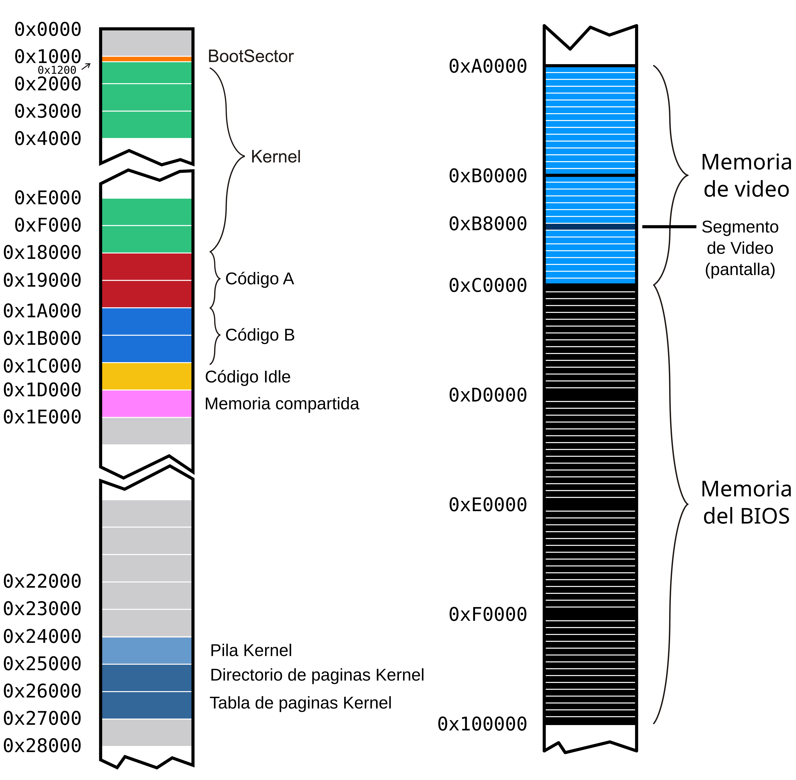
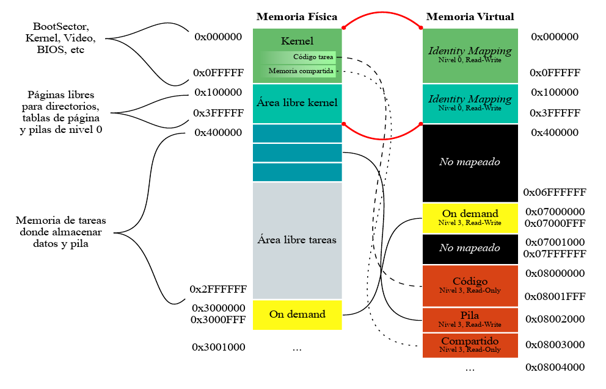

# System Programming: Tareas.

Vamos a continuar trabajando con el kernel que estuvimos programando en
los talleres anteriores. La idea es incorporar la posibilidad de
ejecutar algunas tareas especificas. Para esto vamos a precisar:

-   Definir las estructuras de las tareas disponibles para ser
    ejecutadas

-   Tener un scheduler que determine la tarea a la que le toca
    ejecutase en un periodo de tiempo, y el mecanismo para el
    intercambio de tareas de la CPU

-   Iniciar el kernel con una *tarea inicial* y tener una *tarea idle*
    para cuando no haya tareas en ejecucion

Recordamos el mapeo de memoria con el que venimos trabajando. Las tareas
que vamos a crear en este taller van a ser parte de esta organizacion de
la memoria:





## Archivos provistos

A continuacion les pasamos la lista de archivos que forman parte del
taller de hoy junto con su descripcion:

-   **Makefile** - encargado de compilar y generar la imagen del
    floppy disk.

-   **idle.asm** - codigo de la tarea Idle.

-   **shared.h** -- estructura de la pagina de memoria compartida

-   **tareas/syscall.h** - interfaz para realizar llamadas al sistema
    desde las tareas

-   **tareas/task_lib.h** - Biblioteca con funciones utiles para las
    tareas

-   **tareas/task_prelude.asm**- Codigo de inicializacion para las
    tareas

-   **tareas/taskPong.c** -- codigo de la tarea que usaremos
    (**tareas/taskGameOfLife.c, tareas/taskSnake.c,
    tareas/taskTipear.c **- codigo de otras tareas de ejemplo)

-   **tareas/taskPongScoreboard.c** -- codigo de la tarea que deberan
    completar

-   **tss.h, tss.c** - definicion de estructuras y funciones para el
    manejo de las TSSs

-   **sched.h, sched.c** - scheduler del kernel

-   **tasks.h, tasks.c** - Definicion de estructuras y funciones para
    la administracion de tareas

-   **isr.asm** - Handlers de excepciones y interrupciones (en este
    caso se proveen las rutinas de atencion de interrupciones)

-   **task\_defines.h** - Definiciones generales referente a tareas

## Ejercicios

### Primera parte: Inicializacion de tareas

**1.** Si queremos definir un sistema que utilice solo dos tareas, ¿Que
nuevas estructuras, cantidad de nuevas entradas en las estructuras ya
definidas, y registros tenemos que configurar?¿Que formato tienen?
¿Donde se encuentran almacenadas?


Se necesita configurar dos segmentos TSS junto con sus descriptores en la GDT, mas el registro TR para que guarde el selector al descriptor del TSS de la tarea actual en ejecucion.


**2.** ¿A que llamamos cambio de contexto? ¿Cuando se produce? ¿Que efecto
tiene sobre los registros del procesador? Expliquen en sus palabras que
almacena el registro **TR** y como obtiene la informacion necesaria para
ejecutar una tarea despues de un cambio de contexto.


El cambio de contexto es el proceso en el que se guarda el estado de la tarea actual y se carga otra tarea para que comience o continue su ejecucion. 
Generalmente los cambios de contexto ocurren por interrupciones provocadas por eventos externos, syscalls o excepciones internas pero ultimadamente
depende del sistema operativo. En el caso puntual de este trabajo, se produce en cada tick del clock. Durante el cambio de contexto, el sistema guarda el valor 
de los registros de proposito general, registros de control, registros de segmento, entre otras cosas, a la TSS de la tarea actual. Luego, carga al registro
TR el selector del segmento de la TSS de la nueva tarea y de esta nueva TSS carga el valor de todos los registros mencionados anteriormente.


**3.** Al momento de realizar un cambio de contexto el procesador va
almacenar el estado actual de acuerdo al selector indicado en el
registro **TR** y ha de restaurar aquel almacenado en la TSS cuyo
selector se asigna en el *jmp* far. ¿Que consideraciones deberiamos
tener para poder realizar el primer cambio de contexto? ¿Y cuales cuando
no tenemos tareas que ejecutar o se encuentran todas suspendidas?


Debe tenerse en cuenta la inicializacion de la TSS, con la configuracion de los punteros de pila ESP y SS, el puntero de instruccion EIP y otros registros necesarios 
para que la tarea pueda comenzar a ejecutarse sin problemas. Antes de invocar el primer cambio de contexto, se debe cargar el selector de la TSS inicial en el registro TR 
usando la instruccion ltr para indiciar al CPU donde encontrar la TSS de la primera tarea y la GDT debe tener una entrada especifica para la TSS de la primera tarea. 
Para realizar el primer cambio de contexto, usar la instruccion jmp far indicando el selector de la TSS de la tarea a la que se quiere cambiar, en este caso la idle. 

Cuando no hay tareas activas o estan suspendidas, el scheduler retorna el selector de la TSS para la tarea idle.


**4.** ¿Que hace el scheduler de un Sistema Operativo? ¿A que nos
referimos con que usa una politica?


El scheduler de un sistema operativo es el componente responsable de gestionar la asignacipn del CPU a las distintas tareas en el sistema. Su funcion principal es determinar que tarea debe ejecutarse en cada momento mediante una politica de administracion de tiempo, tal que se coordinen los tiempos de ejecucion de cada tarea antes de cambiar de contexto, logrando asi maximizar el uso eficiente del CPU.


**5.** En un sistema de una unica CPU, ¿como se hace para que los
programas parezcan ejecutarse en simultaneo?


En un sistema con una sola CPU, los programas parecen ejecutarse en simultaneo mediante cambios rapidos de contexto. La CPU se alterna rapidamente entre diferentes tareas, ejecutando cada una por un pequeño intervalo de tiempo segun los criterios programados en el scheduler.


**6.** En **tss.c** se encuentran definidas las TSSs de la Tarea
**Inicial** e **Idle**. Ahora, vamos a agregar el *TSS Descriptor*
correspondiente a estas tareas en la **GDT**.
    
a) Observen que hace el metodo: ***tss_gdt_entry_for_task***

b) Escriban el codigo del metodo ***tss_init*** de **tss.c** que
agrega dos nuevas entradas a la **GDT** correspondientes al
descriptor de TSS de la tarea Inicial e Idle.

c) En **kernel.asm**, luego de habilitar paginacion, agreguen una
llamada a **tss_init** para que efectivamente estas entradas se
agreguen a la **GDT**.

d) Correr el *qemu* y usar **info gdt** para verificar que los
***descriptores de tss*** de la tarea Inicial e Idle esten
efectivamente cargadas en la GDT

**7.** Como vimos, la primer tarea que va a ejecutar el procesador
cuando arranque va a ser la **tarea Inicial**. Se encuentra definida en
**tss.c** y tiene todos sus campos en 0. Antes de que comience a ciclar
infinitamente, completen lo necesario en **kernel.asm** para que cargue
la tarea inicial. Recuerden que la primera vez tenemos que cargar el registro
**TR** (Task Register) con la instruccion **LTR**.
Previamente llamar a la funcion tasks_screen_draw provista para preparar
la pantalla para nuestras tareas.

Si obtienen un error, asegurense de haber proporcionado un selector de
segmento para la tarea inicial. Un selector de segmento no es solo el
indice en la GDT sino que tiene algunos bits con privilegios y el *table
indicator*.

**8.** Una vez que el procesador comenzo su ejecucion en la **tarea Inicial**, 
le vamos a pedir que salte a la **tarea Idle** con un
***JMP***. Para eso, completar en **kernel.asm** el codigo necesario
para saltar intercambiando **TSS**, entre la tarea inicial y la tarea
Idle.

**9.** Utilizando **info tss**, verifiquen el valor del **TR**.
Tambien, verifiquen los valores de los registros **CR3** con **creg** y de los registros de segmento **CS,** **DS**, **SS** con
***sreg***. ¿Por que hace falta tener definida la pila de nivel 0 en la
tss?


Porque en caso de que estemos en nivel 3 y necesitemos pasar a nivel 0 para atender alguna interrupcion, el procesador va a buscar el ss y esp de la pila de nivel 0 al TSS de la tarea actual.


**10.** En **tss.c**, completar la funcion ***tss_create_user_task***
para que inicialice una TSS con los datos correspondientes a una tarea
cualquiera. La funcion recibe por parametro la direccion del codigo de
una tarea y sera utilizada mas adelante para crear tareas.

Las direcciones fisicas del codigo de las tareas se encuentran en
**defines.h** bajo los nombres ***TASK_A_CODE_START*** y
***TASK_B_CODE_START***.

El esquema de paginacion a utilizar es el que hicimos durante la clase
anterior. Tener en cuenta que cada tarea utilizara una pila distinta de
nivel 0.

### Segunda parte: Poniendo todo en marcha

**11.** Estando definidas **sched_task_offset** y **sched_task_selector**:
```
  sched_task_offset: dd 0xFFFFFFFF
  sched_task_selector: dw 0xFFFF
```

Y siendo la siguiente una implementacion de una interrupcion del reloj:

```
global _isr32
  
_isr32:
  pushad
  call pic_finish1
  
  call sched_next_task
  
  str cx
  cmp ax, cx
  je .fin
  
  mov word [sched_task_selector], ax
  jmp far [sched_task_offset]
  
  .fin:
  popad
  iret
```
a)  Expliquen con sus palabras que se estaria ejecutando en cada tic
    del reloj linea por linea


    Primero avisa al pic que se esta atendiendo la interrupcion, luego llama al scheduler para obtener el selector del TSS de la proxima tarea a ejecutar, entonces se compara selector con el selector de la tarea actual con el fin de verificar si se trata de la misma tarea o no, y en caso de ser distintos, se realiza el cambio de contexto.


b)  En la linea que dice ***jmp far \[sched_task_offset\]*** ¿De que
    tamaño es el dato que estaria leyendo desde la memoria? ¿Que
    indica cada uno de estos valores? ¿Tiene algun efecto el offset
    elegido?


    La instruccion lee un dato de 48 bits desde la memoria. Los valores indican al selector del descriptor del TSS de la nueva tarea, y el offset, el cual es ignorado por la instruccion.


c)  ¿A donde regresa la ejecucion (***eip***) de una tarea cuando
    vuelve a ser puesta en ejecucion?


    Cuando una tarea vuelve a ser puesta en ejecucion, el valor del registro EIP se restaurara a la direccion de código donde se habia dejado de ejecutar. Dicho valor se encuentra en la TSS de la tarea en cuestion.


**12.** Para este Taller la catedra ha creado un scheduler que devuelve
la proxima tarea a ejecutar.

a)  En los archivos **sched.c** y **sched.h** se encuentran definidos
    los metodos necesarios para el Scheduler. Expliquen como funciona
    el mismo, es decir, como decide cual es la proxima tarea a
    ejecutar. Pueden encontrarlo en la funcion ***sched_next_task***.


    El scheduler tiene un arreglo de 4 elementos para las tareas que puede ejecutar el sistema. Los elementos del arreglo inician estando vacios y luego toman los valores del selector al descriptor del TSS de la tarea al ejecutarse la funcion "sched_add_task". Luego, en la funcion "sched_next_task", se selecciona la proxima tarea a ejecutar.


b)  Modifiquen **kernel.asm** para llamar a la funcion
    ***sched_init*** luego de iniciar la TSS

c)  Compilen, ejecuten ***qemu*** y vean que todo sigue funcionando
    correctamente.

### Tercera parte: Tareas? Que es eso?

**14.** Como parte de la inicializacion del kernel, en kernel.asm se
pide agregar una llamada a la funcion **tasks\_init** de
**task.c** que a su vez llama a **create_task**. Observe las
siguientes lineas:
```C
int8_t task_id = sched_add_task(gdt_id << 3);

tss_tasks[task_id] = tss_create_user_task(task_code_start[tipo]);

gdt[gdt_id] = tss_gdt_entry_for_task(&tss_tasks[task_id]);
```
a)  ¿Que esta haciendo la funcion ***tss_gdt_entry_for_task***?


    La function tss_gdt_entry_for_task retorna el descriptor de un TSS dado.


b)  ¿Por que motivo se realiza el desplazamiento a izquierda de
    **gdt_id** al pasarlo como parametro de ***sched_add_task***?


    Se desplaza a izquierda porque sched_add_task espera al selector de la tarea, por lo tanto, los primeros tres bits deben corresponder al identificador de la tabla y al RPL, que quedan en 0 porque los descriptores estan en la GDT y solo se puede conmutar tareas en privilegio 0.


**15.** Ejecuten las tareas en *qemu* y observen el codigo de estas
superficialmente.

a) ¿Que mecanismos usan para comunicarse con el kernel?


    Se usan mecanismos como llamadas al sistema, las tareas pueden hacer uso de llamadas al sistema para solicitar servicios del kernel, como acceso a recursos, manejo de archivos, o comunicarse con otras tareas. 
    Esto se logra generalmente a traves de interrupciones o instrucciones especificas que cambian el contexto y permiten que el kernel maneje la solicitud. Otro mecanismo son las estructuras de memoria compartidas, puede haber estructuras de datos en memoria compartida que el kernel y las tareas pueden usar para intercambiar informacion.


b) ¿Por que creen que no hay uso de variables globales? ¿Que pasaria si
    una tarea intentase escribir en su `.data` con nuestro sistema?


    La falta de variables globales es debido a que solo se asigna una pagina de datos para el codigo y la pila. Si una tarea intentara escribir en una variable global, generaria un page fault.


c) Cambien el divisor del PIT para \"acelerar\" la ejecucion de las tareas:
```
    ; El PIT (Programmable Interrupt Timer) corre a 1193182Hz.
    ; Cada iteracion del clock decrementa un contador interno, cuando este llega a cero se emite la interrupcion. El valor inicial es 0x0 que indica 65536, es decir 18.206 Hz.

    DIVISOR equ 0x1F

    mov ax, DIVISOR

    out 0x40, al

    rol ax, 8

    out 0x40, al
```

**16.** Observen **tareas/task_prelude.asm**. El codigo de este archivo
se ubica al principio de las tareas.

a.   ¿Por que la tarea termina en un loop infinito?


    Porque evita comportamiento inesperado al terminar una tarea, si una tarea termina su ejecucion sin un mecanismo que controle la salida, intentaria seguir ejecutando las proximas posiciones de memoria lo cual tendria efectos desconocidos pero seguramente no muy lindos.


b. \[Opcional\] ¿Que podriamos hacer para que esto no sea necesario?


    Para evitar el loop infinito, podriamos definir una syscall que avise al kernel cuando haya terminado la tarea actual en ejecucion, tal que pueda finalizarla anticipadamente y sacarla del scheduler.


### Cuarta parte: Hacer nuestra propia tarea

Ahora programaremos nuestra tarea. La idea es disponer de una tarea que
imprima el *score* (puntaje) de todos los *Pongs* que se estan
ejecutando. Para ello utilizaremos la memoria mapeada *on demand* del
taller anterior.

#### Analisis:

**18.** Analicen el *Makefile* provisto. ¿Por que se definen 2 "tipos"
de tareas? ¿Como harian para ejecutar una tarea distinta? Cambien la
tarea S*nake* por una tarea *PongScoreboard*.


    Se definen dos tipos de tareas ya que esto permite que cada uno seleccione el archivo Fuente de la tarea a compiar.Para ejecutar una tarea diferente deberiamos reemplazar la definicion de uno de los dos tipos por el nombre del archivo de la tarea que deseemos ejecutar junto al .tsk.


**19.** Mirando la tarea *Pong*, ¿En que posicion de memoria escribe
esta tarea el puntaje que queremos imprimir? ¿Como funciona el mecanismo
propuesto para compartir datos entre tareas?


La tarea escribe el puntaje en la direccion virtual 0x7000F00, entre el grupo de direcciones mapeadas on-demand a las direcciones fisicas 0x3000000-0x3000FFF.


#### Programando:

**20.** Completen el codigo de la tarea *PongScoreboard* para que
imprima en la pantalla el puntaje de todas las instancias de *Pong* usando los datos que nos dejan en la pagina compartida.

**21.** \[Opcional\] Resuman con su equipo todas las estructuras vistas
desde el Taller 1 al Taller 4. Escriban el funcionamiento general de
segmentos, interrupciones, paginacion y tareas en los procesadores
Intel. ¿Como interactuan las estructuras? ¿Que configuraciones son
fundamentales a realizar? ¿Como son los niveles de privilegio y acceso a
las estructuras?

**22.** \[Opcional\] ¿Que pasa cuando una tarea dispara una
excepcion? ¿Como podria mejorarse la respuesta del sistema ante estos
eventos?


Cuando una tarea dispara una excepcion, mediante el kernel se imprime la excepcion en pantalla mas el estado de los registros y el sistema se conjela en dicho estado hasta que sea reinicido. Una mejor respuesto del sistema podria ser terminar la tarea que haya provocado el error y que el log de la excepcion se imprima en la ventana correspondiente la tarea que haya originado la excepcion, asi conseguiriamos que solo debamos reiniciar la tarea y no todo el sistema.